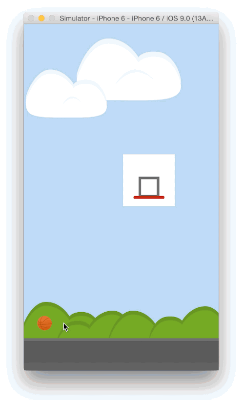

#What's new in UIDynamics
This sample app roughly recreates the hoop physics of [Ball King](https://itunes.apple.com/us/app/ball-king/id946496840?mt=8) (which is a brilliant time waster, you should try it) using UIDynamics, showcasing the new addition to the API introduced in iOS 9.

  

#Setup
This project requires Xcode 7. Just open the provided .xcodeproj.  

#MIT License

	Copyright (c) 2015 Andrea Mazzini. All rights reserved.

	Permission is hereby granted, free of charge, to any person obtaining a
	copy of this software and associated documentation files (the "Software"),
	to deal in the Software without restriction, including
	without limitation the rights to use, copy, modify, merge, publish,
	distribute, sublicense, and/or sell copies of the Software, and to
	permit persons to whom the Software is furnished to do so, subject to
	the following conditions:

	The above copyright notice and this permission notice shall be included
	in all copies or substantial portions of the Software.

	THE SOFTWARE IS PROVIDED "AS IS", WITHOUT WARRANTY OF ANY KIND, EXPRESS
	OR IMPLIED, INCLUDING BUT NOT LIMITED TO THE WARRANTIES OF
	MERCHANTABILITY, FITNESS FOR A PARTICULAR PURPOSE AND NONINFRINGEMENT.
	IN NO EVENT SHALL THE AUTHORS OR COPYRIGHT HOLDERS BE LIABLE FOR ANY
	CLAIM, DAMAGES OR OTHER LIABILITY, WHETHER IN AN ACTION OF CONTRACT,
	TORT OR OTHERWISE, ARISING FROM, OUT OF OR IN CONNECTION WITH THE
	SOFTWARE OR THE USE OR OTHER DEALINGS IN THE SOFTWARE.
	
